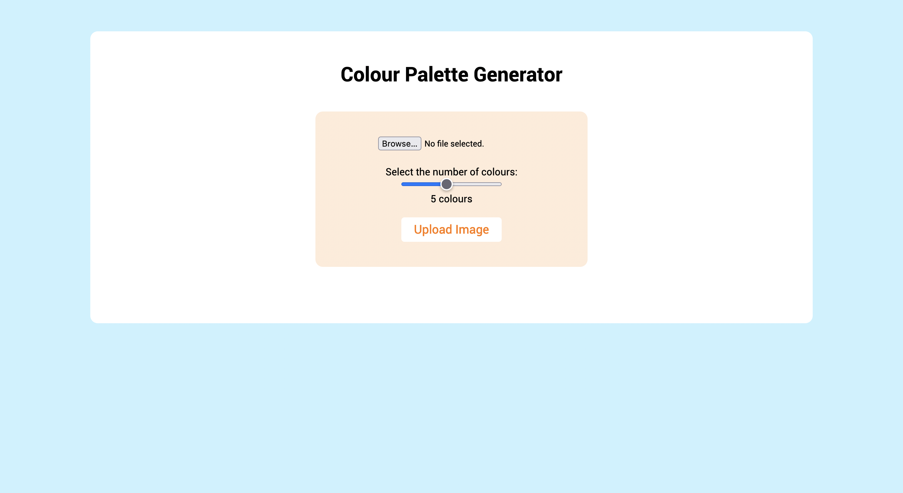
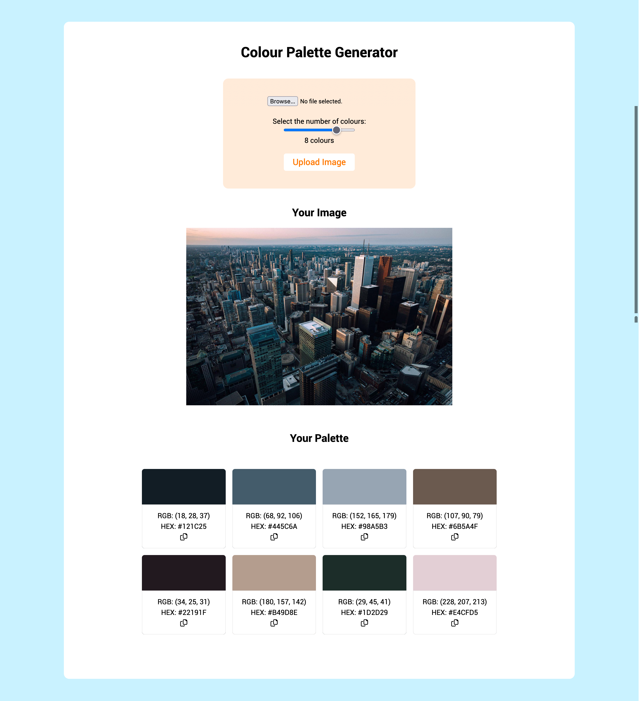

# Colour palette generator 🎨

(Before I start, I live in Canada, so we spell it "colour" and not "color". 🙂)

This app is deployed [here](https://colour-palette-generator-pg.herokuapp.com/).

This is a simple Flask App that lets users upload an image from their device (also works on mobile), select how many colours they would like to extract and then get a palette of colours with RGB and HEX codes.

`main.py` is the python file to run. `initial_version.py` is my first attempt at this project that I decided to leave here for reference. The difference between the two is that `main.py` doesn't save the images.

## 👨🏼‍🎓 Learnings:
1. This project was a great opportunity to learn file uploads using HTML forms.
2. Even though not used in the final version, this project was great to know how to save files and serve them later back to the client.
3. Files can be encoded and decoded if we don't need to save them. We don't need to save users' images anywhere, we just need to extract colours and renders the image back to the user.
4. I learned how to convert RGB values to an HEX code which is one of the most widely used format for designer and creators to handle colour codes.
5. At the time of creation of this app, Heroku temporarily halted deployments from a GitHub repo because of a security issue. I had to learn how to use Heroku's CLI to deploy.

## 🚀 Tech and tools:

This app was built using:
- [Flask](https://flask.palletsprojects.com/en/2.1.x/): microframework for web development
- [Cologram](https://pypi.org/project/colorgram.py/): extract most used colours in the image
- [Pillow](https://pillow.readthedocs.io/en/stable/): open and resize images
- [io module](https://docs.python.org/3/library/io.html): helps handling inputs
- [base64 module](https://docs.python.org/3/library/base64.html): encoding and decoding data

Deployment:
- [Gunicorn](https://gunicorn.org/)
- [GitHub](https://github.com/pierregoaer/colour-palette-generator)
- [Heroku](https://colour-palette-generator-pg.herokuapp.com/)

## ⚙️ How does it work:
1. Select a file from your device (also work with camera library on mobile)
2. Select how many colours you'd like to extract from the image
3. Click "Upload image"

4. The app gives you a grid of the most used colours in this specific image
5. Copy the HEX codes directly from the application
